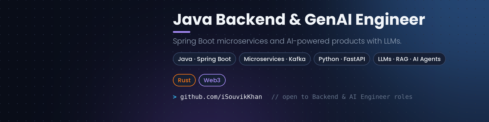

<p align="center">
  
</p>

<h1 align="center">Hi, I'm Souvik Khan 👋</h1>

<p align="center">
  <a href="https://github.com/iSouvikKhan">
    
  </a>
</p>

<p align="center">
  <a href="https://www.linkedin.com/in/khansouvik/"></a>
  <a href="mailto:souvik97381@gmail.com"></a>
  
</p>

<p align="center">
  
  
  
  
</p>

---

## 🧑‍💻 About me

I'm a **Java backend engineer who builds AI into real products.** For nearly **5 years** I've designed and shipped **Spring Boot microservices**, and for the last **2+ years** I've been building **Generative AI** features on top of that foundation: LLM integration, tool calling, RAG and real-time AI voice agents.

- 🏢 **Software Engineer** at **Wiz Digital Services**, previously **Senior Engineer** at **Nagarro**
- 🤖 I care about the engineering *around* the model: validation, idempotency, fallbacks, guardrails and evaluation
- 🖥️ I also build the front ends, in **React, Next.js and Angular**
- 🧪 Quality-first: TDD, 80%+ test coverage and thorough code reviews
- 🌱 Currently learning: **Rust** and **Web3**: smart contracts on **Ethereum** (Solidity) and programs on **Solana** (Rust + Anchor)
- 🏅 **SAFe 5 Practitioner**

```yaml
souvik:
  role: Java Backend Engineer + GenAI Engineer
  core: [Java, Spring Boot, Microservices, Kafka]
  ai: [LLM Integration, Tool Calling, RAG, AI Agents, Voice AI]
  also: [Python, FastAPI, React, Next.js, Angular]
  cloud: [AWS, Azure, Docker, Kubernetes]
  learning: [Rust, Ethereum, Solidity, Solana, Anchor]
  open_to: [Backend Engineer, Java Developer, AI Engineer]
```

---

## 🚀 What I build at work

<table>
<tr>
<td width="50%" valign="top">

### 🎙️ AI Voice Commerce Platform
Customers call, an **ElevenLabs** voice agent takes their order, and **Spring Boot** services turn it into a validated order in real time.

- LLM **tool calling** with structured JSON outputs
- Conversation flow, system prompts and **guardrails**
- **Fallbacks** and human hand-off for unclear requests
- Signed, **idempotent** webhooks with Spring Security
- **Angular** dashboard for live calls and orders

`Java` `Spring Boot` `LLM Tool Calling` `ElevenLabs` `Angular`

</td>
<td width="50%" valign="top">

### 🧹 Data Command
An AI-assisted **Master Data Management** platform that turns dirty CSV datasets into trusted **golden records**.

- Multi-step **FastAPI** pipeline: profiling, cleansing, matching, AI enrichment, merging, AI validation
- **LLM-assisted** cleansing and fuzzy matching
- **Next.js** UI to review steps and approve merges
- **100K+ records** per run, ~**40%** fewer duplicates

`Python` `FastAPI` `LLMs` `Next.js` `PostgreSQL`

</td>
</tr>
</table>

<sub>Company projects: source code is private, happy to discuss the architecture in detail.</sub>

---

## 📂 Featured projects

| Project | What it is | Stack | Status |
|---|---|---|---|
| [**OrderStream**](https://github.com/iSouvikKhan/orderstream-microservices) | Event-driven e-commerce microservices with the Saga pattern and transactional outbox | Java 17 · Spring Boot 3 · Kafka · PostgreSQL · Redis · Kubernetes | 🚧 In progress |
| [**SupportPilot**](https://github.com/iSouvikKhan/supportpilot-spring-ai) | AI customer-support agent with RAG, tool calling and human approval for sensitive actions | Java 21 · Spring AI · pgvector · Angular | 🚧 In progress |
| [**DocuMind**](https://github.com/iSouvikKhan/documind-rag) | RAG document Q&A with hybrid retrieval, re-ranking, citations and an evaluation set | Python · FastAPI · LangChain · pgvector · React | 🚧 In progress |
| [**ChurnSense**](https://github.com/iSouvikKhan/churnsense-ml-api) | Churn-prediction ML model served as a versioned API | Python · scikit-learn · FastAPI · Docker | 🚧 In progress |
| [**PayTm**](https://github.com/iSouvikKhan/PayTm) | Digital wallet with consistent transfers using MongoDB transactions | React · Express · MongoDB · Tailwind | 🚧 In progress |
| [**Medium**](https://github.com/iSouvikKhan/Medium) | Blogging platform deployed on Cloudflare Workers | React · Express · PostgreSQL · Prisma | 🚧 In progress |

---

## 🛠️ Tech stack

**Languages**


**Backend**


**Generative AI**


**Frontend**


**Data**


**Cloud & DevOps**


**Testing & Tools**


**Currently learning**


---

## 🧭 How I engineer

- **Design for failure.** Retries, dead-letter queues, idempotency and circuit breakers are part of the design, not afterthoughts.
- **Treat LLMs as unreliable dependencies.** Validate every output, constrain it with schemas, and always have a fallback.
- **Measure before optimising.** I tuned APIs ~35% faster by profiling queries, not by guessing.
- **Tests are the spec.** High coverage and clear tests make refactoring safe.
- **Keep it simple.** The right architecture is the simplest one that meets today's scale and can grow.

---

## 💼 Experience

| Role | Company | Period |
|---|---|---|
| Software Engineer | Wiz Digital Services | Dec 2025 – Present |
| Senior Engineer | Nagarro | Jul 2024 – Dec 2025 |
| Engineer | Nagarro | Jan 2023 – Jun 2024 |
| Associate Engineer | Nagarro | Nov 2021 – Dec 2022 |

🎓 **B.Tech, Mechanical Engineering**, Techno India University (2016 – 2020) · GPA 8.6/10 · Rank 1 in department

---

## 📊 GitHub stats

<p align="center">
  <picture>
    <source media="(prefers-color-scheme: dark)" srcset="https://github-readme-stats.vercel.app/api?username=iSouvikKhan&show_icons=true&count_private=true&include_all_commits=true&hide_border=true&theme=tokyonight"/>
    
  </picture>
  <picture>
    <source media="(prefers-color-scheme: dark)" srcset="https://github-readme-stats.vercel.app/api/top-langs/?username=iSouvikKhan&layout=compact&langs_count=8&hide_border=true&theme=tokyonight"/>
    
  </picture>
</p>

<p align="center">
  <picture>
    <source media="(prefers-color-scheme: dark)" srcset="https://streak-stats.demolab.com?user=iSouvikKhan&hide_border=true&theme=tokyonight"/>
    
  </picture>
</p>

---

## 📫 Let's connect

I'm open to **Backend Engineer, Java Developer and AI Engineer** roles in Bengaluru, other Indian tech hubs, or remote.

<p>
  <a href="https://www.linkedin.com/in/khansouvik/"></a>
  <a href="mailto:souvik97381@gmail.com"></a>
</p>

<p align="center"><sub>⭐ If you find any of my projects useful, a star is always appreciated.</sub></p>
